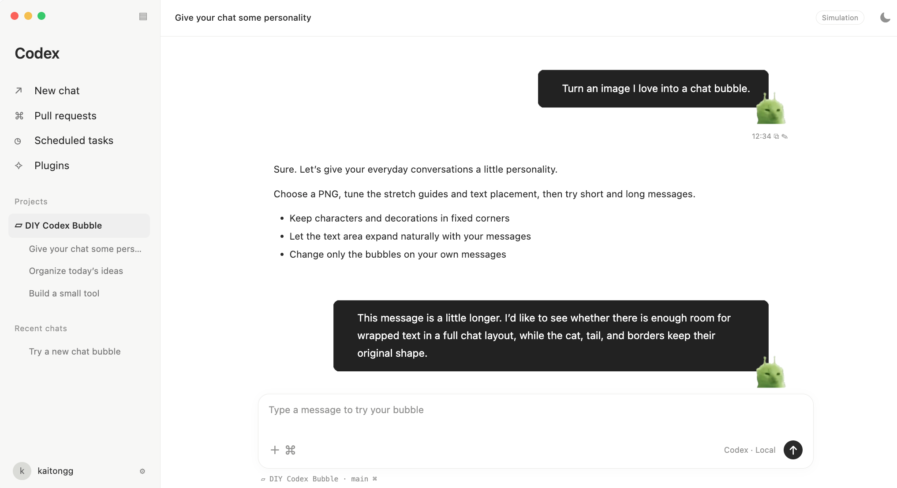
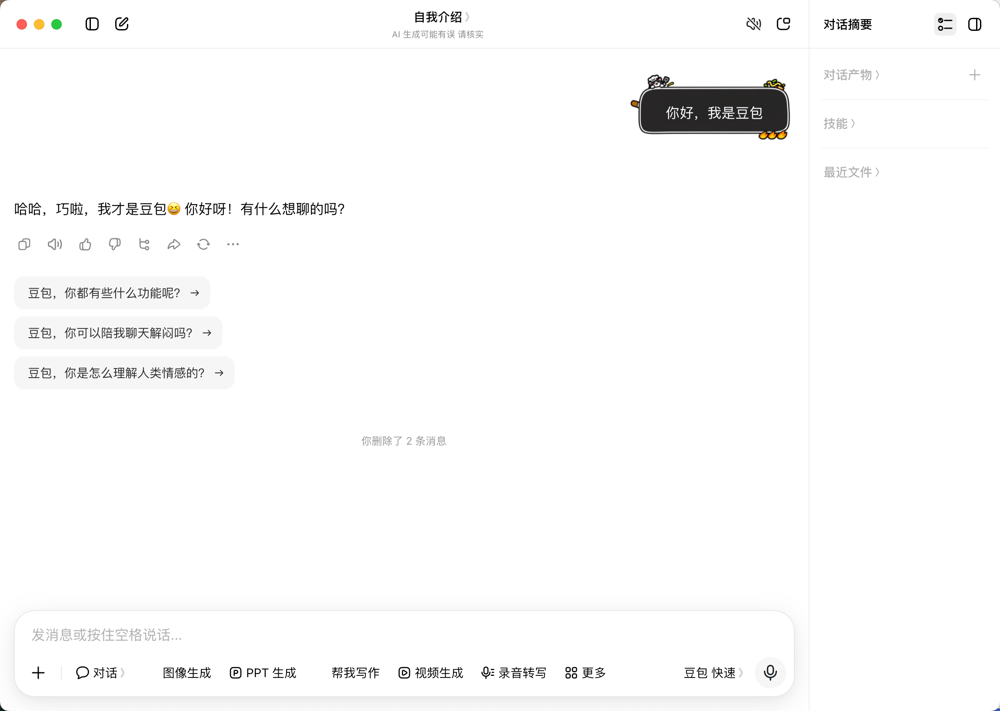
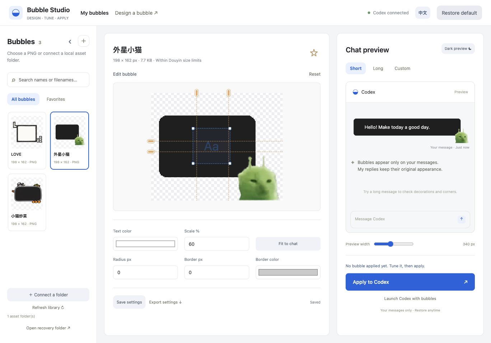
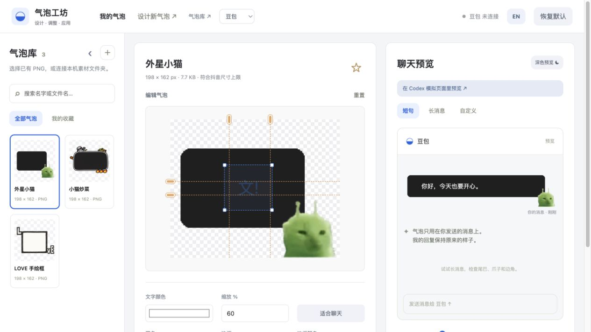

# DIY Codex Bubble · Bubble Studio

[中文](README.md) · **English**

Use the [bubble design skill](https://github.com/kaitongg-bit/douyinQIPAO) to create a chat bubble image, or **turn an image you love into a Codex chat bubble.**

The built-in Bubble Studio lets you personalize stretch guides, text placement, colors, corners, and borders. Alien cats, LOVE frames, cooking cats—give your everyday messages a little personality.

Supports **Codex and Doubao desktop apps**. Only **your messages** get a bubble. Assistant replies keep their original appearance. Click **Restore default** whenever you want to switch back.

**macOS only · Chinese / English UI · Local library · Restore anytime · Non-commercial only**

An independent appearance tool. **Not an official OpenAI or Codex product.** It does not modify the official app installation.

[Bubble gallery / Contribute](https://kaitongg-bit.github.io/DIYcodex-bubble/) · [Download the latest release](https://github.com/kaitongg-bit/DIYcodex-bubble/releases/latest) · [Create your own bubble](#want-to-create-your-own-bubble) · [Usage responsibility](#license-and-responsibility)

The desktop studio source stays on the default `main` branch. The public gallery is generated separately and published from `gh-pages`, so normal source downloads do not include the Pages output.

*Try the artwork with short and long messages. This is an independent simulation, not a real Codex screenshot.*

Real Doubao chat: your messages get a custom bubble while assistant replies keep their original appearance.

*This is a light-mode studio preview, not a screenshot of a real Codex conversation. Example images are shown for illustration; their appearance does not grant rights to third-party content.*

## From an image to your own bubble

- **Keep your favorites together.** Import PNGs or choose a local asset folder in Finder. Search, favorite, and switch between designs.
- **Tune it directly on the canvas.** Drag the gold handles to set stretch guides. Move and resize the blue text box—no four-sided coordinate inputs.
- **Preview before applying.** Try short messages, long messages, or your own text, on light and dark backgrounds.
- **Make it yours.** Adjust text color, scale, corner radius, and an extra border. **Fit to chat** helps size large images comfortably.
- **Apply when ready.** Each bubble keeps its own settings. Change designs or restore the default anytime.

Use **EN / 中文** in the top-right corner to switch languages. Your bubble settings and unsaved edits stay in place.

## Getting started

Currently supported on **macOS with the Codex / ChatGPT or Doubao desktop app**. Python 3.9+ and Node.js 22+ must already be installed. This release is not a standalone app with bundled runtimes.

1. [Download the latest ZIP](https://github.com/kaitongg-bit/DIYcodex-bubble/releases/latest) and extract it somewhere you can keep it.
2. In **Finder**, double-click `Start Bubble Studio.command`. A Terminal window opens to keep the studio running; leave it open while using the studio.
3. Open [Bubble Studio](http://127.0.0.1:19329). Click **＋** to import a PNG, or **Connect a folder** to select your asset folder.
4. Select **Codex / Doubao** in the header, choose and tune a bubble, then save and apply it to the selected app.

**Not connected?** Save your current input and fully quit the selected desktop app with `⌘Q`. Open the studio in Safari or Chrome, then click its **Launch … with bubbles** button. The initial connection requires restarting the desktop app; the studio never force-quits your conversation. Closing a window is not the same as quitting.

**Seeing source code after double-clicking?** Open the launcher from Finder. Codex's file preview only displays its contents. For runtime requirements and running from source, see [Development notes](DEVELOPMENT.md).

## One studio, two apps

Choose Codex or Doubao in the header. They share PNGs and the editor, while active bubbles and connection status stay separate. Switching apps does not apply a theme. Restore affects only the selected app; deleting an image used by both restores both.

Doubao's user-message selector is built in. The supported macOS installation is `/Applications/Doubao.app`; future app updates may require adaptation. Existing Codex settings migrate without losing artwork or active themes. Doubao starts with no active theme.

Stop any older standalone Doubao studio before using this version to avoid competing monitors. Its private `.local/` files are not bundled or published. Connect your original asset folder to reuse PNGs. The full-window simulator remains Codex-inspired; Doubao uses the ordinary bubble preview.

## A tip for better stretching

**Keep stretch guides on straight, continuous edges.** Leave characters, tails, curved corners, and detailed decorations in fixed areas. Check both short and long messages before applying.

Images do not need to match Douyin's dimensions. Larger PNGs work too; use **Fit to chat** to size them. 100% means the original image size. Scaling the artwork does not change the text's font size.

## Recoverable deletion

The **×** on an asset moves its PNG to the studio's recovery folder. **Undo delete** restores it. **This also moves the original file from a connected folder.**

To delete permanently, click **Open recovery folder**, move unwanted files to macOS Trash in Finder, and empty Trash yourself. Emptying Trash cannot be undone. Refresh the library to update recovery records.

## Want to create your own bubble?

The companion [bubble design skill](https://github.com/kaitongg-bit/douyinQIPAO) helps you create PNG artwork in your own Codex session. It is maintained separately from this project.

Import the finished PNG here to tune, preview, and apply it. The studio's **Design a bubble** entry links to the skill and provides a prompt; it does not host an image-generation service.

## Try a bubble before bringing it into chat

[Open the online gallery](https://kaitongg-bit.github.io/DIYcodex-bubble/). Pick a design and try it in a Codex-inspired desktop chat simulator, with light/dark themes and your own sample messages. It never connects to your account or reads real conversations.

**Alien Cat, LOVE, and Cooking Cat** are included on the desktop studio's first launch. Nothing is automatically applied to your chats. Use **Restore built-in presets** to recover deleted presets.

Download a PNG and its `.bubble.json` settings from a work's detail page. Import and select the PNG in the desktop studio, then **Import settings** to retain its stretch guides and text placement. Preview before applying.

In the [online workshop](https://kaitongg-bit.github.io/DIYcodex-bubble/workshop.html), choose **Create a bubble** and upload a PNG. A full Codex simulation appears above the editor, which shares the desktop studio's stretch, text-position and rendering logic. **Save settings** lets you download the original PNG and `.bubble.json`, then copy instructions for a new Codex chat. Attach both files there so Codex can import them into your local studio and apply the result. Until you choose **Publish my bubble**, the image stays in your browser; there is no AI image generation.

To share it, choose **Publish my bubble** and enter a nickname and bubble name. The PNG and its current settings enter a private review queue together. The maintainer publishes approved works manually; no account is required.

Public counts come from each PNG's GitHub Releases download statistics. They may be delayed and do not represent unique users. Unavailable counts are shown as unavailable. The local gallery labels its separate, local-only counter.

## License and responsibility

**Commercial use is prohibited.** Source code is available for personal learning, research, and other non-commercial purposes under the [Non-Commercial License](LICENSE). Selling copies, paid services, commercial integration, advertising or subscription monetization, business operations, and producing commercial materials are prohibited.

Publishing source code does not grant rights to images, character IP, likenesses, or trademarks. Users must obtain the necessary rights and are responsible for their content and actions. Permission to use an image does not remove this software's non-commercial restriction. The same applies to character IP, nudity, and adult content.

The authors and maintainers do not endorse user content or uses. The software is provided as is, with liability limited to the extent permitted by applicable law. See [Usage responsibility](RESPONSIBILITY.md) and [LICENSE](LICENSE); the license is in English, and the additional responsibility document is in Chinese.

These terms apply from v0.1.10 onward. Earlier MIT-licensed releases retain their original license.

---

Contributing? [Development notes](DEVELOPMENT.md) · [Community notes](COMMUNITY.md) · [Agent instructions](AGENTS.md)
