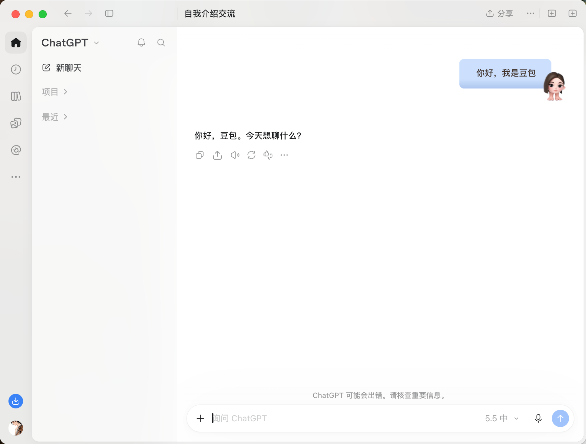

  

<h2 align="center">DIY Codex Bubble · Bubble Studio</h2>

<h4 align="center">Turn any image into your Codex chat bubble.</h4>

  
  
  
  
  

  <a href="./README.md">中文</a> · <strong>English</strong>

  <a href="https://github.com/kaitongg-bit/DIYcodex-bubble/releases/latest"><strong>Download</strong></a> ·
  <a href="https://kaitongg-bit.github.io/DIYcodex-bubble/">Bubble Gallery</a> ·
  <a href="#gallery-and-community">Contribute</a> ·
  <a href="DEVELOPMENT.md">Development</a>

Works with the **Codex / ChatGPT and Doubao desktop apps** on macOS. Only **your messages** get a bubble — assistant replies keep their original look. Click **Restore default** to switch back anytime.

**macOS only · English / 中文 UI · Local library · Restore anytime · MIT licensed**

> An independent appearance tool. **Not an official OpenAI or Codex product.** It does not modify the official app installation. The desktop studio lives on `main`; the public gallery is generated separately and published from `gh-pages`, so source downloads do not include it.

## Features

- **Keep your favorites together.** Import PNGs or pick a local asset folder in Finder. Search, favorite, and switch anytime.
- **Tune directly on the canvas.** Drag the gold handles to set stretch guides; move and resize the blue text box — no four-sided coordinate inputs.
- **Preview before applying.** Try short messages, long messages, or your own text, in light and dark themes.
- **Add the finishing touches.** Text color, scale, corner radius, and an extra border; **Fit to chat** sizes large images comfortably.
- **Apply when ready.** Each bubble keeps its own settings. Switch designs or restore the default anytime.

Use **EN / 中文** in the top-right corner to switch languages. Bubble settings and unsaved edits stay in place.

## Screenshots

<table align="center">
  <tr>
    <td align="center"> Real ChatGPT chat: your messages get a custom bubble while assistant replies keep their original look</td>
    <td align="center"> Real Doubao chat: your messages get a custom bubble while assistant replies keep their original look</td>
  </tr>
</table>

   
  Light-mode studio preview (the studio itself, not a real conversation screenshot)

## Quick start

Currently supported on **macOS with the Codex / ChatGPT or Doubao desktop app**. Python 3.9+ and Node.js 22+ must already be installed. This is not a standalone app with bundled runtimes.

1. [Download the latest ZIP](https://github.com/kaitongg-bit/DIYcodex-bubble/releases/latest) and extract it somewhere you can keep.
2. In **Finder**, double-click `Start Bubble Studio.command`. A Terminal window opens to keep the studio running; leave it open while using the studio.
3. Open [Bubble Studio](http://127.0.0.1:19329). Try the three built-in presets, click **＋** to import a PNG, or **Connect a folder** to select your asset folder.
4. Select **Codex / Doubao** in the header, tune and preview a bubble, save it, then click **Apply to Codex** or **Apply to Doubao**.

**Not connected?** Save your current input and fully quit the selected desktop app with `⌘Q`. Open the studio in Safari or Chrome, then click its **Launch … with bubbles** button. The first connection requires restarting the desktop app; the studio never force-quits your conversation. Closing a window is not the same as quitting.

**Seeing source code after double-clicking?** Open the launcher from Finder — Codex's file preview only displays its contents. For runtime requirements and running from source, see [Development notes](DEVELOPMENT.md).

## Usage

### One studio, two apps

Choose Codex or Doubao in the header. They share the PNG library and editor, while active bubbles and connection status stay separate. Switching apps does not apply a theme; **Restore** affects only the selected app. Deleting an image used by both restores both.

  

Doubao's user-message selector is built in; the supported installation is `/Applications/Doubao.app`, and app updates may require adaptation. Existing Codex settings migrate without losing artwork or active themes; Doubao starts with no active theme. If you ran an older standalone Doubao studio, stop it first to avoid competing monitors. Its private `.local/` files are not bundled or published; connect your original asset folder to reuse PNGs.

### A tip for better stretching

**Keep stretch guides on straight, continuous edges.** Leave characters, tails, curved corners, and detailed decorations in fixed areas. Check both short and long messages before applying.

Images do not need to match Douyin dimensions. Larger PNGs work too; use **Fit to chat** to size them. 100% means the original image size. Scaling the artwork does not change the text's font size.

### Recoverable deletion

The **×** on an asset moves its PNG to the studio's recovery folder; **Undo delete** restores it. **This also moves the original file from a connected folder.**

To delete permanently, click **Open recovery folder**, move unwanted files to macOS Trash in Finder, then empty the Trash yourself. Emptying the Trash cannot be undone; refresh the library to update recovery records.

## Gallery and community

[Open the online gallery](https://kaitongg-bit.github.io/DIYcodex-bubble/). Pick a design and try it in a Codex-inspired desktop chat simulator, with light/dark themes and your own sample messages. It never connects to your account or reads real conversations.

   
  The simulator in the online gallery: check bubble effects with short and long messages (independent simulation, not a real Codex screenshot)

**Alien Cat, LOVE, and Cooking Cat** are included on the desktop studio's first launch. Nothing is automatically applied to your chats. Use **Restore built-in presets** to recover deleted presets.

- **Import a work's settings**: Download a PNG and its `.bubble.json` from a work's detail page. Import and select the PNG in the desktop studio, then **Import settings** to retain its stretch guides and text placement. Preview before applying.
- **Create in the online workshop**: Choose **Create a bubble** and upload a PNG. A full Codex simulation appears above an editor that shares the desktop studio's stretch, text-position, and rendering logic. **Save settings** lets you download the original PNG and `.bubble.json`; until you choose **Publish my bubble**, the image stays in your browser — nothing is uploaded and there is no AI image generation.
- **Publish**: Choose **Publish my bubble** and enter a nickname and bubble name. The PNG and its current settings enter a private review queue together; the maintainer publishes approved works manually, no account required. Review criteria: [COMMUNITY.md](COMMUNITY.md).
- **Download counts**: Public counts come from each PNG's GitHub Releases download statistics. They may be delayed and do not represent unique users; unavailable counts are shown as unavailable. The local gallery labels its separate, local-only counter.

Want to design your own bubble? The companion [bubble design skill](https://github.com/kaitongg-bit/douyinQIPAO) helps you create PNG artwork in your own Codex session. Import the finished PNG here to tune, preview, and apply it.

## License and responsibility

The code is released under the [MIT License](LICENSE) — free to use, modify, and distribute, including commercially.

The code license does not grant rights to images, character IP, likenesses, or trademarks. Users must obtain the necessary rights and are responsible for their content and actions; character IP, nudity, or adult content does not become licensed just by being made or shown with this tool. The authors and maintainers do not endorse user content or uses. The software is provided "as is" under the MIT License, with liability limited to the extent permitted by applicable law. See [Usage responsibility](RESPONSIBILITY.md).

## Related documents

- [Development notes](DEVELOPMENT.md)
- [Community notes](COMMUNITY.md)
- [Agent instructions](AGENTS.md)
