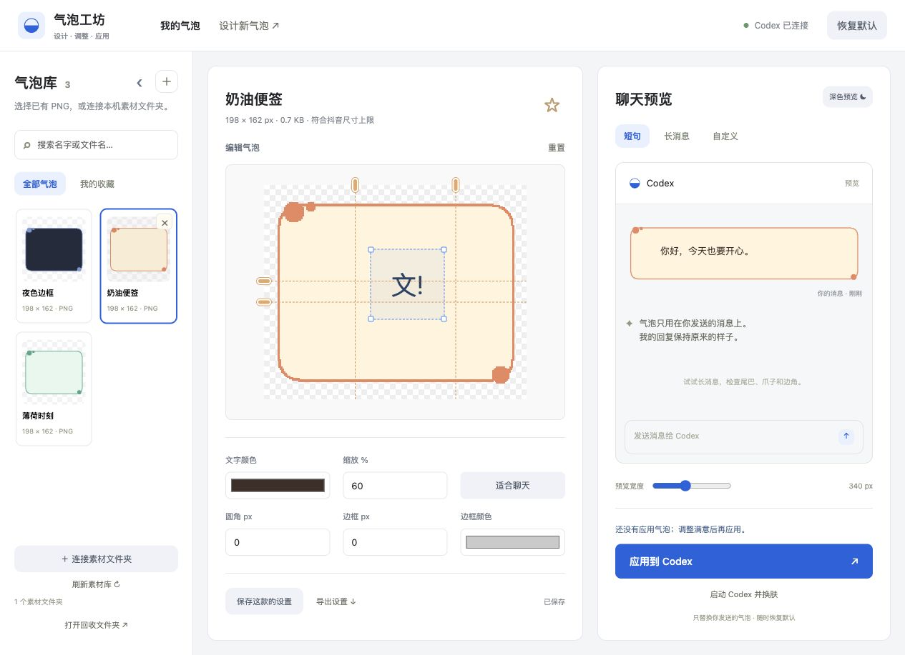
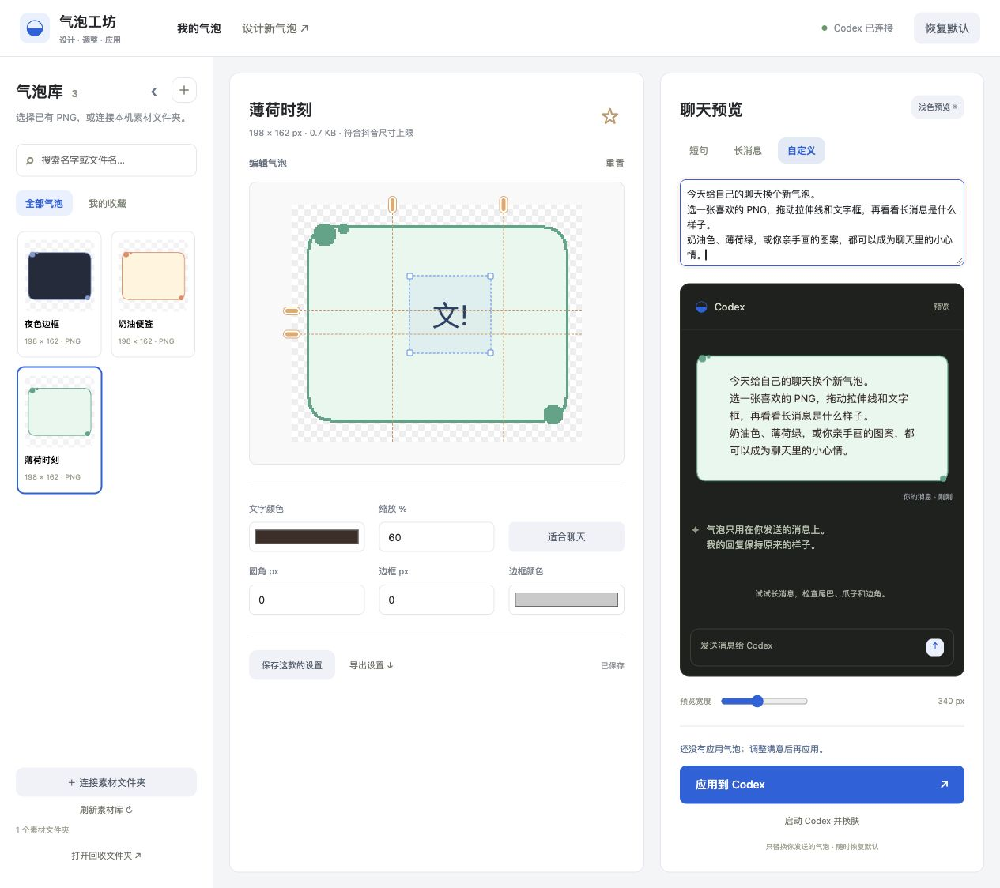

# DIY Codex Bubble · 气泡工坊

**把喜欢的图片，变成你自己的 Codex 聊天气泡。**

手绘边框、奶油便签、极简色块……选一张 PNG，拖一拖，让每天发出的消息多一点自己的风格。

只替换 **你发送的气泡**，Codex 的回复保持原样。想换回来，点击「恢复默认」就好。

**macOS 专用 · 本机素材库 · 可视化调整 · 随时恢复 · 禁止商用**

[下载最新版](https://github.com/kaitongg-bit/DIYcodex-bubble/releases/latest) · [想画新气泡？](#想画一款自己的气泡) · [使用责任](RESPONSIBILITY.md)

*界面截图使用原创演示素材。你也可以换成自己的 PNG。*

## 从一张图片，到一个喜欢的气泡

- **把素材收进自己的库。** 导入 PNG，或在 Finder 中选择整个素材文件夹。搜索、收藏、切换，喜欢的款式随时都在。
- **直接在图上调。** 拖动金色手柄设置拉伸线，拖动蓝色文字框调整文字位置和空间，不用计算四边数字。
- **短句长话都看看。** 实时预览短句、长消息和自己的文字，还能切换浅色、深色背景。
- **再加一点细节。** 改文字颜色、缩放、圆角和边框；「适合聊天」帮你把大图缩到合适的大小。
- **满意就应用。** 每款气泡各自保存设置。可以随时换一款，也可以一键恢复默认。

## 第一次用，跟着这几步

目前只支持 **macOS 上的 Codex / ChatGPT 桌面应用**，需要电脑已有 Python 3.9+ 和 Node.js 22+。暂不提供免安装运行环境的独立 App。

1. [下载最新版 ZIP](https://github.com/kaitongg-bit/DIYcodex-bubble/releases/latest)，解压到一个方便保留的位置。
2. 在 **Finder（访达）** 中双击 `Start Bubble Studio.command`。出现终端窗口是正常的，它负责让工坊保持运行，使用时先别关闭。
3. 打开 [气泡工坊](http://127.0.0.1:19329)，点左上角 **＋** 导入图片，或点「连接素材文件夹」选择你的素材目录。
4. 选一款气泡，在画布上调整，看看聊天预览，保存后点击「应用到 Codex」。

**显示“未连接”？** 先保存正在输入的内容，用 `⌘Q` 完全退出 Codex / ChatGPT；在 Safari 或 Chrome 打开工坊，再点「启动 Codex 并换肤」。首次连接需要重新启动应用，工坊不会强制关闭你的聊天。仅关闭窗口不算退出。

**双击后只看到了代码？** 请从 Finder 打开启动文件，Codex 的文件预览只是查看代码。如果提示缺少运行环境，或需要从源码启动，见 [运行与开发说明](DEVELOPMENT.md)。

## 调气泡的一个小窍门

**拉伸线尽量落在平直、连续的边上。** 把尾巴、角色、弧形边角和复杂装饰留在固定区域，长消息就不容易把它们拉坏。应用前，记得同时看看短句和长消息。

不要求 PNG 是抖音规格：常见大图也可以导入，点击「适合聊天」调整大小。100% 表示原图大小，文字字号不会跟着图案一起放大。

## 删除也有后悔药

素材卡片上的 **×** 会把 PNG 移入工坊回收区，点「撤销删除」可以恢复。**连接文件夹中的原文件也会一起移入回收区**，请留意这一点。

想彻底删掉，点「打开回收文件夹」，在 Finder 中移入系统废纸篓，再自行清空。清空后无法恢复；回到工坊刷新即可更新记录。

## 想画一款自己的气泡？

配套的 [抖音气泡设计 skill](https://github.com/kaitongg-bit/douyinQIPAO) 可以帮助你设计原创 PNG。它独立维护和更新，不必跟着工坊一起升级。

画好后把图片导入这里，再调整、预览、应用。工坊里的「设计新气泡」也能找到这个入口。

## 版权与使用责任

**禁止商用。** 本项目源码可见，仅限个人学习、研究及其他非商业用途，采用 [非商业使用许可证](LICENSE)。禁止售卖、收费服务、商业产品集成、广告或订阅变现，以及用于商业运营或制作商业素材。

本项目是非官方的外观工具。**代码公开不等于图片、角色 IP、肖像或商标可以随意使用。**

用户需自行取得素材授权，并承担内容制作、传播及违法侵权行为的相应责任。取得素材授权也不解除本工具的禁止商用限制。角色 IP、裸露或成人内容也不例外。作者与维护者不为用户素材和用途背书；软件按现状提供，在适用法律允许的范围内不承担由此产生的责任。详见 [素材权利与使用责任](RESPONSIBILITY.md)。

本许可证从 v0.1.10 起适用；此前按 MIT 发布的版本仍按其原许可证处理。

---

想参与改进？[开发说明](DEVELOPMENT.md) · [验证记录](VALIDATION.md) · [Agent 指引](AGENTS.md)
